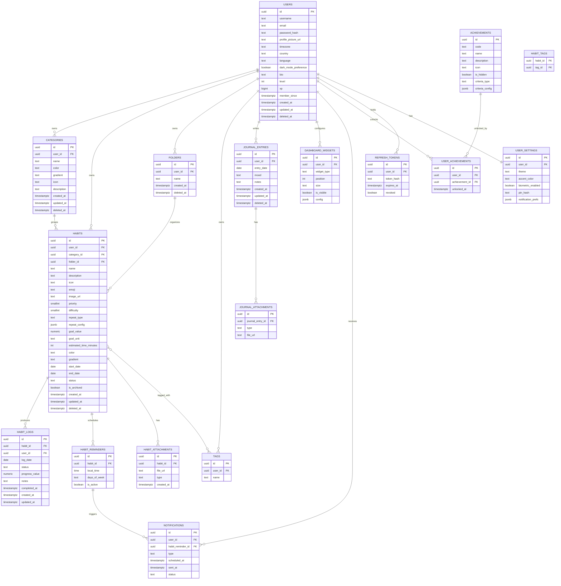

# PostgreSQL Schema — v1

## Conventions

- **UUID primary keys** (`gen_random_uuid()`, via `pgcrypto`) everywhere, not serial
  ints — avoids enumeration attacks on a personal-data API, and lets the offline-first
  Flutter client generate IDs locally before a row ever reaches the server (needed for
  M10 sync, where a habit created offline needs an ID before it can be referenced by a
  log created in the same offline session).
- **Audit fields** on every table: `created_at timestamptz not null default now()`,
  `updated_at timestamptz not null default now()` (trigger-maintained), `deleted_at
  timestamptz` (soft delete — `null` = active).
- **Ownership**: almost every table has a `user_id` FK — Forge is single-tenant-per-user
  data, there is no cross-user sharing in v1, so row-level authorization is always
  "does `user_id` match the authenticated principal."
- Foreign keys `on delete cascade` for strictly-owned children (e.g. `habit_logs` when a
  `habit` is hard-deleted from an export/purge flow); soft delete is the normal path so
  cascade rarely fires in practice.

## ER Diagram

## Notes on key design decisions

- **`repeat_config` and `criteria_config` as JSONB**: repeat schedules (`specific days`,
  `custom schedule`) and achievement criteria are structurally variable (a "specific days"
  rule needs a day-of-week set, a "monthly" rule needs a day-of-month). Modeling every
  variant as its own set of nullable columns would sprawl; JSONB with an application-level
  schema (validated in the Service layer, documented in `docs/api/openapi.yaml`) keeps the
  table stable while `repeat_type`/`criteria_type` stays a plain indexed enum for
  filtering/reporting queries.
- **`streaks` is not a stored table** — current/best/monthly/category streaks are derived
  from `habit_logs` at read time (or maintained in a materialized view once reporting
  load justifies it, revisited in M7). Storing a mutable running counter risks drift from
  the source-of-truth log rows; recomputing from logs is the source of truth.
- **`achievements` is a global catalog, `user_achievements` is the per-user unlock
  record** — new achievements can be added by inserting a catalog row without a schema
  migration touching user data.

## Indexes (initial set)

- `habits(user_id, category_id)`, `habits(user_id, status) where deleted_at is null`
- `habit_logs(habit_id, log_date)` unique — one log per habit per day
- `habit_logs(user_id, log_date)` — powers dashboard "today" and calendar queries
- `categories(user_id)`, `journal_entries(user_id, entry_date)` unique
- `user_achievements(user_id, achievement_id)` unique
- `refresh_tokens(token_hash)` unique, `refresh_tokens(user_id)`

## Constraints

- `habit_logs`: `unique (habit_id, log_date)` — enforces idempotent daily completion at
  the DB layer, not just application logic.
- `journal_entries`: `unique (user_id, entry_date)` — one journal entry per day.
- `users.email`: unique.
- Check constraints: `habits.difficulty between 1 and 5`, `habits.priority between 1 and
  3`, `habit_logs.status in ('completed','missed','skipped')`.

## Migrations

Flyway, versioned SQL files in `backend/src/main/resources/db/migration/`. First
migration (`V1__init.sql`) created in Milestone 1; every milestone after that ships its
own `V{n}__*.sql` rather than editing `V1`.
