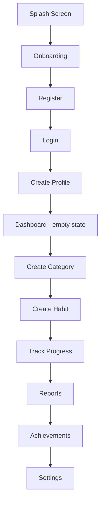

# Forge — Product Specification

## Vision

Forge is a **Personal Operating System**, not a habit tracker. Users build their own
lifestyle system: categories and habits are 100% user-defined, nothing is pre-seeded.
Quality bar: Apple Health / Notion / Duolingo / GitHub / Spotify / Linear — dark-mode
first, premium, minimal, animated.

## Modules (feature scope)

| Module | Scope | Milestone |
|---|---|---|
| Auth & Onboarding | Register, login, JWT, profile creation, splash/onboarding | M2 |
| Dashboard | Customizable widget home screen | M3 |
| Categories | User-created life areas (name/color/gradient/icon) | M4 |
| Habits | Full habit model, repeat rules, reminders, goals | M5 |
| Tracking | Habit logs, streaks, XP/gamification | M6 |
| Reports | Stats, heatmaps, charts across time ranges | M7 |
| Achievements | Rule-based badge engine, hidden achievements | M8 |
| Notifications | Local + FCM push reminders | M9 |
| Offline Sync | Local-first storage, background sync | M10 |
| Journal | Daily mood/notes/photo/voice entries | cross-cutting |
| Profile | User stats, settings, theme, security | cross-cutting |
| Search | Global search across all entities | cross-cutting |
| Export/Import | JSON/CSV/PDF, backup/restore | cross-cutting |
| Theming | 10 built-in themes + custom accents | cross-cutting |

## Core User Flow

**Hard rule:** after registration the dashboard is empty. No default categories, no
default habits, no sample data. Everything the user sees, they created.

## Screen Inventory

Each screen below will get a full UI/UX pass (purpose, components, interactions,
animations, empty/loading/error states, accessibility, responsive behavior) at the start
of its owning milestone — not upfront, so the design reflects what the API can actually
support by that point.

1. Splash
2. Onboarding (carousel, 3–4 slides)
3. Register
4. Login
5. Create Profile (avatar, timezone, country, language, dark-mode pref)
6. Dashboard (customizable widget grid)
7. Category List / Create / Edit
8. Habit List (per category, list/grid/timeline/kanban/minimal)
9. Habit Create / Edit (multi-step form)
10. Habit Detail (log history, streak, notes, attachments)
11. Calendar (month view → day drill-down)
12. Journal Entry (per day)
13. Reports / Statistics
14. Achievements Gallery
15. Global Search
16. Profile
17. Settings (theme, notifications, security, language, export/import)

## Non-Goals (v1)

- Social features (following, sharing, leaderboards) — not in scope until explicitly requested.
- Google/Apple login, Firebase Storage, Redis, Kubernetes, AWS — deferred per the stated
  "future" tags in the tech stack; build the seams (interfaces) but not the implementations.
- Web target — Flutter's architecture stays platform-agnostic (Clean Architecture +
  responsive layout) so web is a build-target flip later, not a rewrite.
